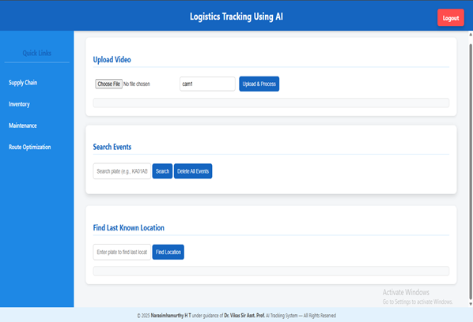
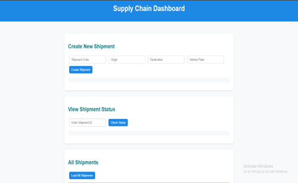
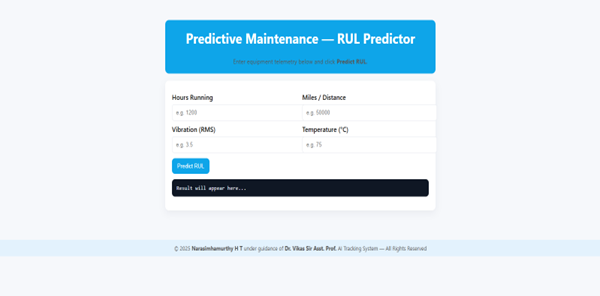
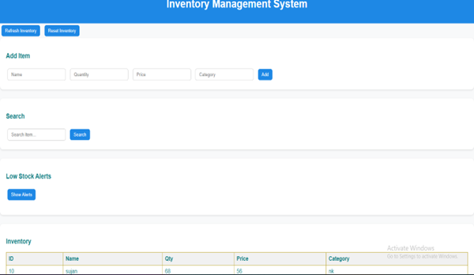
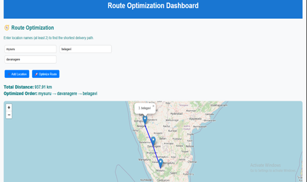

# Logistics AI Tracking 🚚

**Logistics-AI-Tracking** is a full-stack AI-based logistics vehicle tracking system built with Python, Flask, and YOLOv8.
It detects vehicles in surveillance video, extracts number plates using OCR, and shows their **last known location** based on the camera that captured them.

## Objectives
 
- [x] Real Time Location Tracking Using CCTV cameras
- [x] Supply Chain
- [x] Predictive Maintainance
- [x] Inventory Management
- [x] Route Optimization

 ## Features
 
- [x] User Aunthentication
- [x] Number Plate Detection
- [x] Vehicle Location Tracking With CAM IDs
- [x] Track The Last Location Of Logistics Vehicle
- [x] Number Of Route Optimization
- [x] Logistics Data storage
- [x] Independent Transpotations
- [x] Reduce Manual Work
- [x] Cost Effective
- [x] Route Optimization
- [x] Inventory Status
- [x] Predict URL of Vehicle

      


## Quick start (local run)

1. Create & activate a virtualenv:
   ```
   python3 -m venv venv
   source venv/bin/activate
   ```
2. Install Python deps:
   ```
   pip install -r requirements.txt
   ```
3. Install system Tesseract (Ubuntu):
   ```
   sudo apt-get update && sudo apt-get install -y tesseract-ocr
   ```
4. Download the YOLOv8 model :
   ```
   python download_model.py
   ```
5. Run the server:
   ```
   python app.py
   ```
6. Open http://localhost:5000

# Screen Shots
 
## Login Page
<div align="center">
  
</div>

## Register Page
<div align="center">
  
</div>

## Main Page
<div align="center">
  
</div>

## Supply Chain
<div align="center">
  
</div>

## Predictive Maintainance
<div align="center">
  
</div>

## Inventory Management
<div align="center">
  
</div>

## Route Optimization
<div align="center">
  
</div> 

Note

   


